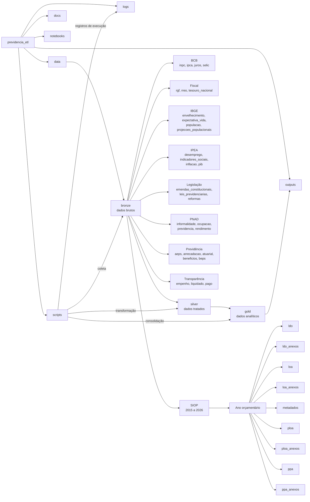

# Diagrama relacional da estrutura `previdencia_etl`

## Leitura geral

A pasta segue uma lógica de pipeline ETL:

- `data/bronze`: entrada bruta por fonte ou tema.
- `data/silver`: espaço reservado para dados tratados.
- `data/gold`: espaço reservado para dados consolidados/analíticos.
- `scripts`: tende a concentrar rotinas de coleta, transformação e consolidação.
- `outputs`: tende a receber produtos finais, relatórios, tabelas e visualizações.
- `logs`: tende a guardar registros de execução.
- `docs` e `notebooks`: apoio documental e análise exploratória.

No ZIP analisado, os arquivos encontrados estão concentrados em `data/bronze/siop`, principalmente PDFs de LOA, PLOA e anexos entre 2015 e 2026.

## Diagrama Mermaid



## Árvore completa de pastas

```text
└── previdencia_etl/
    ├── data/
    │   ├── bronze/
    │   │   ├── bcb/
    │   │   │   ├── inpc/
    │   │   │   ├── ipca/
    │   │   │   ├── juros/
    │   │   │   └── selic/
    │   │   ├── fiscal/
    │   │   │   ├── rgf/
    │   │   │   ├── rreo/
    │   │   │   └── tesouro_nacional/
    │   │   ├── ibge/
    │   │   │   ├── envelhecimento/
    │   │   │   ├── expectativa_vida/
    │   │   │   ├── populacao/
    │   │   │   └── projecoes_populacionais/
    │   │   ├── ipea/
    │   │   │   ├── desemprego/
    │   │   │   ├── indicadores_sociais/
    │   │   │   ├── inflacao/
    │   │   │   └── pib/
    │   │   ├── legislacao/
    │   │   │   ├── emendas_constitucionais/
    │   │   │   ├── leis_previdenciarias/
    │   │   │   └── reformas/
    │   │   ├── pnad/
    │   │   │   ├── informalidade/
    │   │   │   ├── ocupacao/
    │   │   │   ├── previdencia/
    │   │   │   └── rendimento/
    │   │   ├── previdencia/
    │   │   │   ├── aeps/
    │   │   │   ├── arrecadacao/
    │   │   │   ├── atuarial/
    │   │   │   ├── beneficios/
    │   │   │   └── beps/
    │   │   ├── siop/
    │   │   │   ├── 2015/
    │   │   │   │   ├── ldo/
    │   │   │   │   ├── ldo_anexos/
    │   │   │   │   ├── loa/
    │   │   │   │   ├── loa_anexos/
    │   │   │   │   ├── metadados/
    │   │   │   │   ├── ploa/
    │   │   │   │   ├── ploa_anexos/
    │   │   │   │   ├── ppa/
    │   │   │   │   └── ppa_anexos/
    │   │   │   ├── 2016/
    │   │   │   │   ├── ldo/
    │   │   │   │   ├── ldo_anexos/
    │   │   │   │   ├── loa/
    │   │   │   │   ├── loa_anexos/
    │   │   │   │   ├── metadados/
    │   │   │   │   ├── ploa/
    │   │   │   │   ├── ploa_anexos/
    │   │   │   │   ├── ppa/
    │   │   │   │   └── ppa_anexos/
    │   │   │   ├── 2017/
    │   │   │   │   ├── ldo/
    │   │   │   │   ├── ldo_anexos/
    │   │   │   │   ├── loa/
    │   │   │   │   ├── loa_anexos/
    │   │   │   │   ├── metadados/
    │   │   │   │   ├── ploa/
    │   │   │   │   ├── ploa_anexos/
    │   │   │   │   ├── ppa/
    │   │   │   │   └── ppa_anexos/
    │   │   │   ├── 2018/
    │   │   │   │   ├── ldo/
    │   │   │   │   ├── ldo_anexos/
    │   │   │   │   ├── loa/
    │   │   │   │   ├── loa_anexos/
    │   │   │   │   ├── metadados/
    │   │   │   │   ├── ploa/
    │   │   │   │   ├── ploa_anexos/
    │   │   │   │   ├── ppa/
    │   │   │   │   └── ppa_anexos/
    │   │   │   ├── 2019/
    │   │   │   │   ├── ldo/
    │   │   │   │   ├── ldo_anexos/
    │   │   │   │   ├── loa/
    │   │   │   │   ├── loa_anexos/
    │   │   │   │   ├── metadados/
    │   │   │   │   ├── ploa/
    │   │   │   │   ├── ploa_anexos/
    │   │   │   │   ├── ppa/
    │   │   │   │   └── ppa_anexos/
    │   │   │   ├── 2020/
    │   │   │   │   ├── ldo/
    │   │   │   │   ├── ldo_anexos/
    │   │   │   │   ├── loa/
    │   │   │   │   ├── loa_anexos/
    │   │   │   │   ├── metadados/
    │   │   │   │   ├── ploa/
    │   │   │   │   ├── ploa_anexos/
    │   │   │   │   ├── ppa/
    │   │   │   │   └── ppa_anexos/
    │   │   │   ├── 2021/
    │   │   │   │   ├── ldo/
    │   │   │   │   ├── ldo_anexos/
    │   │   │   │   ├── loa/
    │   │   │   │   ├── loa_anexos/
    │   │   │   │   ├── metadados/
    │   │   │   │   ├── ploa/
    │   │   │   │   ├── ploa_anexos/
    │   │   │   │   ├── ppa/
    │   │   │   │   └── ppa_anexos/
    │   │   │   ├── 2022/
    │   │   │   │   ├── ldo/
    │   │   │   │   ├── ldo_anexos/
    │   │   │   │   ├── loa/
    │   │   │   │   ├── loa_anexos/
    │   │   │   │   ├── metadados/
    │   │   │   │   ├── ploa/
    │   │   │   │   ├── ploa_anexos/
    │   │   │   │   ├── ppa/
    │   │   │   │   └── ppa_anexos/
    │   │   │   ├── 2023/
    │   │   │   │   ├── ldo/
    │   │   │   │   ├── ldo_anexos/
    │   │   │   │   ├── loa/
    │   │   │   │   ├── loa_anexos/
    │   │   │   │   ├── metadados/
    │   │   │   │   ├── ploa/
    │   │   │   │   ├── ploa_anexos/
    │   │   │   │   ├── ppa/
    │   │   │   │   └── ppa_anexos/
    │   │   │   ├── 2024/
    │   │   │   │   ├── ldo/
    │   │   │   │   ├── ldo_anexos/
    │   │   │   │   ├── loa/
    │   │   │   │   ├── loa_anexos/
    │   │   │   │   ├── metadados/
    │   │   │   │   ├── ploa/
    │   │   │   │   ├── ploa_anexos/
    │   │   │   │   ├── ppa/
    │   │   │   │   └── ppa_anexos/
    │   │   │   ├── 2025/
    │   │   │   │   ├── ldo/
    │   │   │   │   ├── ldo_anexos/
    │   │   │   │   ├── loa/
    │   │   │   │   ├── loa_anexos/
    │   │   │   │   ├── metadados/
    │   │   │   │   ├── ploa/
    │   │   │   │   ├── ploa_anexos/
    │   │   │   │   ├── ppa/
    │   │   │   │   └── ppa_anexos/
    │   │   │   └── 2026/
    │   │   │       ├── ldo/
    │   │   │       ├── ldo_anexos/
    │   │   │       ├── loa/
    │   │   │       ├── loa_anexos/
    │   │   │       ├── metadados/
    │   │   │       ├── ploa/
    │   │   │       ├── ploa_anexos/
    │   │   │       ├── ppa/
    │   │   │       └── ppa_anexos/
    │   │   └── transparencia/
    │   │       ├── empenho/
    │   │       ├── liquidado/
    │   │       └── pago/
    │   ├── gold/
    │   └── silver/
    ├── docs/
    ├── logs/
    ├── notebooks/
    ├── outputs/
    └── scripts/
```
